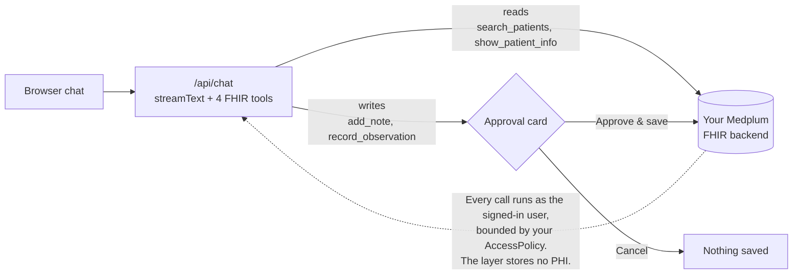

# Last EHR

[](https://github.com/cbetz/last-ehr/actions/workflows/ci.yml)
[](LICENSE)

**Open-source AI agent layer for Medplum and FHIR.** A permissioned agent over the patient chart: it reads the chart and proposes writes, and nothing is saved until you approve it. Bring your own backend and your own model key.

> **Last EHR is a _layer_, not an EHR.** It runs *on top of* a headless FHIR backend (Medplum today) and talks to it over the FHIR API. It is not the system of record, stores no PHI of its own, and never bundles or forks the backend.

**Status: early / alpha.** APIs, structure, and scope will change. Use synthetic data only. · License: [Apache-2.0](./LICENSE)

**[Try the live demo](https://www.lastehr.com/demo)**: no sign-up, synthetic data, and every write goes through the approval gate.


## What it does

- A chat agent (Vercel AI SDK) with FHIR tools. It **reads** the chart (search patients, view a patient chart) and **writes** to it (add a note, record an observation), streamed and rendered as structured cards.
- **Writes are confirmation-gated**: the agent proposes a write, you approve it, and only then is it saved. Nothing touches the chart without your click.
- Authentication, multi-tenancy, and access control are delegated to your **Medplum** project (`Project` = tenant, `ProjectMembership` = user, `AccessPolicy` = RBAC). Last EHR doesn't reimplement any of that, and writes are bounded by your AccessPolicy.

## What it isn't

- Not a charting EHR, not a system of record, and not a Medplum replacement. It's a thin agent layer: a small, growing set of tools over your FHIR backend.
- Not a guarantee. The approval gate is a human-in-the-loop boundary, not a safety proof: it stops unilateral writes, but it relies on you reading what you approve. Models can propose wrong or fabricated clinical facts, and approval fatigue is real. Last EHR provides the gate; you provide the review.

## How it works

Next.js 15 (App Router) + React 19. The agent lives in `app/api/chat/route.ts` (`streamText` + FHIR tools); the FHIR calls go through a small backend interface ([`lib/fhir/backend.ts`](./lib/fhir/backend.ts)) whose only adapter today wraps `@medplum/core` against the Medplum instance you configure. **Backend-agnostic is the goal**: the interface is three methods (search, search resources, create resource) plus contract notes, so an adapter for another headless EHR is a small, well-scoped contribution. Aidbox, Oystehr, and HAPI adapters are tracked in [#39](https://github.com/cbetz/last-ehr/issues/39), [#40](https://github.com/cbetz/last-ehr/issues/40), and [#44](https://github.com/cbetz/last-ehr/issues/44).



On the public demo, writes are also tagged with your session, so you only ever see the seed data plus your own edits.

## Quickstart

**Fastest**: try the hosted demo at [lastehr.com/demo](https://www.lastehr.com/demo). No account, no keys, synthetic data.

**One-click deploy** with your own keys:

[](https://vercel.com/new/clone?repository-url=https%3A%2F%2Fgithub.com%2Fcbetz%2Flast-ehr&env=OPENAI_API_KEY,MEDPLUM_CLIENT_ID,MEDPLUM_CLIENT_SECRET,NEXT_PUBLIC_QUICKSTART&envDescription=A%20model%20key%20plus%20Medplum%20ClientApplication%20credentials%20for%20the%20no-sign-in%20quickstart&envLink=https%3A%2F%2Fgithub.com%2Fcbetz%2Flast-ehr%2Fblob%2Fmain%2F.env.example)

You'll still need a **Medplum** project seeded with the synthetic patients (`npm run seed`, below) for the demo to have data.

**Run it locally.** Prerequisites: Node ≥ 20.9, a **Medplum** project (Medplum-hosted [free tier](https://app.medplum.com/) or your own), and one model API key (OpenAI or Anthropic).

```bash
git clone https://github.com/cbetz/last-ehr.git
cd last-ehr
npm install
cp .env.example .env.local      # then edit .env.local (see below)
npm run seed                     # load synthetic patients into your Medplum
npm run dev                      # http://localhost:3000/demo
```

At minimum set, in `.env.local`:

- a model key: `OPENAI_API_KEY` (default provider) **or** `ANTHROPIC_API_KEY` with `AI_PROVIDER=anthropic`;
- `NEXT_PUBLIC_MEDPLUM_BASE_URL` / `MEDPLUM_BASE_URL` if you're pointing at your own Medplum (leave blank to use Medplum's hosted API);
- `MEDPLUM_CLIENT_ID` + `MEDPLUM_CLIENT_SECRET` (a Medplum [ClientApplication](https://www.medplum.com/docs/auth/methods/client-credentials)): used by `npm run seed`, and by the **no-sign-in quickstart** when you also set `NEXT_PUBLIC_QUICKSTART=true`. Or set `NEXT_PUBLIC_MEDPLUM_GOOGLE_CLIENT_ID` to sign in via Medplum's Google OAuth instead.

`npm run seed` loads a small **synthetic** patient set (`scripts/fixtures/patients.ts`: four patients with conditions, medications, allergies, immunizations, and vitals/labs, two named "Smith"). It wipes and recreates those patients each run, so it is safe to re-run. Then open `/demo` and ask: *"find patients named Smith."* Use synthetic data only.

## Launch from the Medplum app (SMART on FHIR)

Last EHR can launch directly from app.medplum.com. Register it once in your
Medplum project by creating a **ClientApplication** with:

- `launchUri` = `https://<your-deploy>/launch`
- `redirectUri` = `https://<your-deploy>/launch/callback`

then set `SMART_CLIENT_ID` to that ClientApplication's id in your deployment.
Last EHR appears on the **Apps tab of every Patient and Encounter page**;
launching it opens the chat already scoped to that patient, reusing your
Medplum sign-in (SMART App Launch with PKCE, public client, no secret). The
token is bounded by the granted SMART scopes and your AccessPolicy, and writes
still stop at the approval card.

## Use the tools over MCP

The same four FHIR tools run as an MCP server (stdio), so Claude Desktop,
Claude Code, or any MCP client can work a chart against your Medplum project:

```bash
npm run mcp
```

Auth mirrors the seed script: `MEDPLUM_CLIENT_ID` + `MEDPLUM_CLIENT_SECRET`
(or `MEDPLUM_ACCESS_TOKEN`), plus `MEDPLUM_BASE_URL` if self-hosted, from
`.env.local` or your MCP client's server config. Register with Claude Code,
for example:

```bash
claude mcp add lastehr -- npm --prefix /path/to/last-ehr run mcp
```

**The server starts read-only.** There is no approval card over MCP; your MCP
client's own tool prompt is the only gate. Start it with
`LASTEHR_MCP_WRITES=true` to also expose `add_note` and `record_observation`,
and treat every approved call as a direct chart write. Design discussion in
[#45](https://github.com/cbetz/last-ehr/issues/45).

## Configuration

Every variable is documented in [`.env.example`](./.env.example). The model is provider-agnostic: set `AI_PROVIDER` (`openai` | `anthropic`), optionally `MODEL_ID`, and the matching key. Analytics (PostHog) and the marketing-site waitlist (Neon) are optional and lastehr.com-specific.

## Security & data

Last EHR stores no patient data of its own; everything lives in your FHIR backend. But be clear about what the approval gate is: **it is a write-safety control, not a privacy control.** Anything the agent reads from the chart is sent to your model provider as context, under your API key, with no approval step.

**Use synthetic data unless you have real agreements in place.** Pointing this at real PHI requires, at minimum:

- a BAA with your **model provider** that covers your API traffic (consumer plans don't qualify);
- a HIPAA-eligible **FHIR backend** with its own BAA;
- your own compliance review. This project is alpha and is **not** a HIPAA-covered service; PHI handling is the operator's responsibility.

See [SECURITY.md](./SECURITY.md) for the full posture and how to report vulnerabilities.

## Open-core

Self-hosting is free and Apache-2.0. A managed hosted tier (managed Medplum + a signed BAA, multi-tenancy, billing) may follow, built only after the open-source core has traction.

## Not affiliated

A personal open-source project. Not affiliated with, endorsed by, or sponsored by Medplum, Vercel, or any employer.

## License

[Apache-2.0](./LICENSE). See [NOTICE](./NOTICE) for third-party attributions and [CONTRIBUTING.md](./CONTRIBUTING.md) to contribute.
