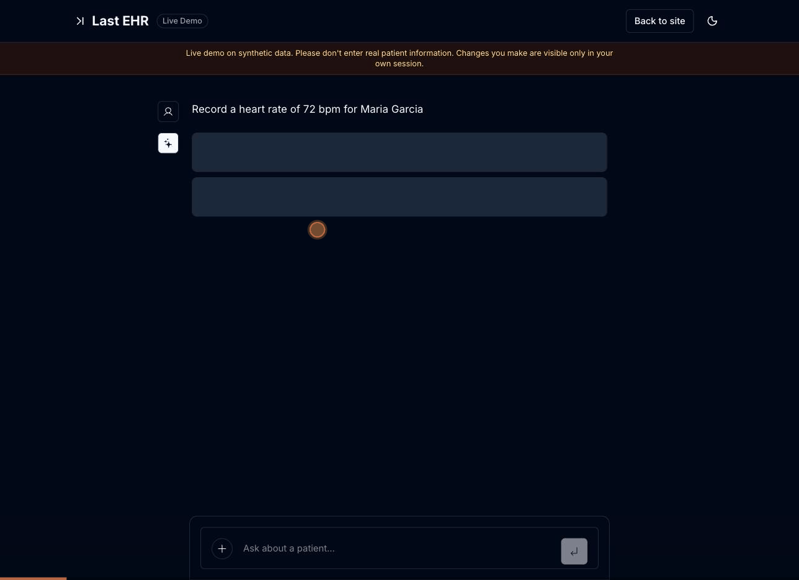
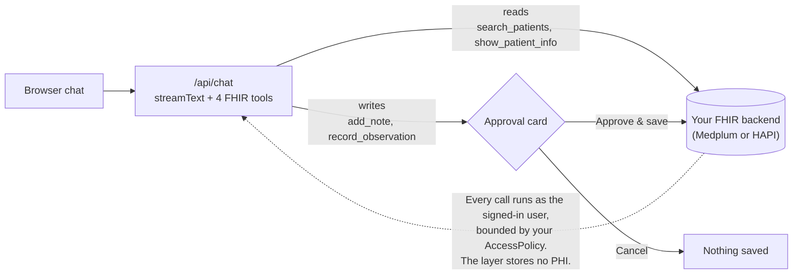

# Last EHR

[](https://github.com/cbetz/last-ehr/actions/workflows/ci.yml)
[](LICENSE)
[](https://www.npmjs.com/package/@lastehr/mcp)
[](https://registry.modelcontextprotocol.io/?q=io.github.cbetz%2Flast-ehr)

**Open-source reference implementation for approval-gated FHIR agents.** A
permissioned agent over the patient chart: it reads the chart and proposes
writes, and nothing is saved until you approve it. Bring your own backend and
your own model key when you want a real agent—or start with the zero-key local
synthetic walkthrough.

> **Last EHR is a _layer_, not an EHR.** It runs *on top of* a headless FHIR backend (Medplum, or HAPI FHIR for local synthetic evaluation) and talks to it over the FHIR API. It is not the system of record, stores no PHI of its own, and never bundles or forks the backend.

**Status: early / alpha.** APIs, structure, and scope will change. Use synthetic data only. · License: [Apache-2.0](./LICENSE)

**[Try the live demo](https://www.lastehr.com/demo)**: no sign-up, synthetic data, and every write goes through the approval gate.



## Start here

| Goal | Start here |
| --- | --- |
| See the approval loop now | [Try the live synthetic-data demo](https://www.lastehr.com/demo) — no sign-up. |
| Give an MCP client bounded Medplum chart reads | `npx -y @lastehr/mcp init --client claude-code` |
| Try fixture MCP locally without FHIR credentials or a provider API key | `npm run mcp:demo -- --client claude-code` |
| Prove the synthetic web-agent workflow locally | `npm run eval` |
| Inspect the complete flow locally with no account or model key | `npm run demo:local` |

### 30-second synthetic-data walkthrough

1. Open the [live demo](https://www.lastehr.com/demo).
2. Ask: `Find patients named Smith`.
3. Ask: `Record a heart rate of 72 bpm for Maria Garcia`.
4. Inspect the proposed write, then approve it. The data is synthetic and the
   approval card shows exactly what will be saved.

For MCP, `@lastehr/mcp` is deliberately a separate **read-only** surface:
`search_patients` and `show_patient_info` only. Configure a least-privilege
Medplum token before connecting it to a real project; full setup is in the
[MCP guide](./docs/mcp.md) and the [Official MCP Registry listing](https://registry.modelcontextprotocol.io/?q=io.github.cbetz%2Flast-ehr).

Want to inspect those two MCP tools before configuring Medplum? From a
checkout, `npm run mcp:demo` starts the included local HAPI stack, resets the
four synthetic fixture charts, and prints a Claude Code/Cursor configuration.
That checkout-only **MCP Local Lab** needs no FHIR/Medplum credentials or
model-provider API key of its own and is restricted to fixture patients. Your
MCP client still uses its normal account and may send those synthetic results
to its model provider. It is not the published package, generic HAPI support,
or a path for PHI.

For a deterministic safety-mechanics check, `npm run eval` creates a separate
synthetic target, proves the proposal/approval and denial paths, verifies chart
association, cleans up, and writes a scrubbed report. It is not a clinical,
authorization, or compliance certification; see the [evaluation guide](./docs/evals.md).

## What it does

- A chat agent (Vercel AI SDK) with FHIR tools. It **reads** the chart (search patients, view a patient chart) and **writes** to it (add a note, record an observation), streamed and rendered as structured cards.
- **Writes are confirmation-gated**: the agent proposes a write, you approve it, and only then is it saved. Nothing touches the chart without your click.
- Authentication, multi-tenancy, and access control are delegated to your **Medplum** project (`Project` = tenant, `ProjectMembership` = user, `AccessPolicy` = RBAC). Last EHR doesn't reimplement any of that, and writes are bounded by your AccessPolicy.

## Support status

Last EHR is **Medplum-supported** for authenticated deployments and includes a
**local, no-auth HAPI FHIR mode** for synthetic-data evaluation. Other FHIR R4
backends need an adapter before they are supported. See the full
[support matrix](./docs/support.md) for the web, SMART, MCP, auth, and
evaluation boundaries before choosing a path.

## What it isn't

- Not a charting EHR, not a system of record, and not a Medplum replacement. It's a thin agent layer: a small, growing set of tools over your FHIR backend.
- Not a guarantee. The approval gate is a human-in-the-loop boundary, not a safety proof: it stops unilateral writes, but it relies on you reading what you approve. Models can propose wrong or fabricated clinical facts, and approval fatigue is real. Last EHR provides the gate; you provide the review.

## How it works

Next.js 15 (App Router) + React 19. The agent lives in `app/api/chat/route.ts` (`streamText` + FHIR tools); the FHIR calls go through a small backend interface ([`lib/fhir/backend.ts`](./lib/fhir/backend.ts)) with two built-in adapters: Medplum (hosted or self-hosted, token-authenticated) and local HAPI FHIR for synthetic evaluation. The interface is four methods plus contract notes, so an adapter for another headless EHR is a small, well-scoped contribution. See [docs/adapters.md](./docs/adapters.md) and the [roadmap](./ROADMAP.md).



On the public demo, writes are also tagged with your session, so you only ever see the seed data plus your own edits.

## Quickstart

**Fastest**: try the hosted demo at [lastehr.com/demo](https://www.lastehr.com/demo). No account, no keys, synthetic data.

**One-click deploy** with your own keys:

[](https://vercel.com/new/clone?repository-url=https%3A%2F%2Fgithub.com%2Fcbetz%2Flast-ehr&env=OPENAI_API_KEY,MEDPLUM_CLIENT_ID,MEDPLUM_CLIENT_SECRET,NEXT_PUBLIC_QUICKSTART&envDescription=A%20model%20key%20plus%20Medplum%20ClientApplication%20credentials%20for%20the%20no-sign-in%20quickstart&envLink=https%3A%2F%2Fgithub.com%2Fcbetz%2Flast-ehr%2Fblob%2Fmain%2F.env.example)

You'll still need a **Medplum** project seeded with the synthetic patients (`npm run seed`, below) for the demo to have data.

**Run it locally.** Prerequisites: Node 22.18+ (or 24.2+), a **Medplum** project (Medplum-hosted [free tier](https://app.medplum.com/) or your own), and one tool-capable model API key (OpenAI, Anthropic, or Amazon Bedrock).

```bash
git clone https://github.com/cbetz/last-ehr.git
cd last-ehr
npm install
cp .env.example .env.local      # then edit .env.local (see below)
npm run seed                     # load synthetic patients into your Medplum
npm run dev                      # http://localhost:3000/demo
```

At minimum set, in `.env.local`:

- a model key: `OPENAI_API_KEY` (default provider), **or** `ANTHROPIC_API_KEY` with `AI_PROVIDER=anthropic`, **or** AWS credentials plus `AI_PROVIDER=bedrock` and `MODEL_ID`;
- `NEXT_PUBLIC_MEDPLUM_BASE_URL` / `MEDPLUM_BASE_URL` if you're pointing at your own Medplum (leave blank to use Medplum's hosted API);
- `MEDPLUM_CLIENT_ID` + `MEDPLUM_CLIENT_SECRET` (a Medplum [ClientApplication](https://www.medplum.com/docs/auth/methods/client-credentials)): used by `npm run seed`, and by the **no-sign-in quickstart** when you also set `NEXT_PUBLIC_QUICKSTART=true`. Or set `NEXT_PUBLIC_MEDPLUM_GOOGLE_CLIENT_ID` to sign in via Medplum's Google OAuth instead.

`npm run seed` loads a small **synthetic** patient set (`scripts/fixtures/patients.ts`: four patients with conditions, medications, allergies, immunizations, and vitals/labs, two named "Smith"). It wipes and recreates those patients each run, so it is safe to re-run. Then open `/demo` and ask: *"find patients named Smith."* Use synthetic data only.

**Local FHIR stack, no Medplum account or model key:** the repo ships a Docker
Compose stack with HAPI FHIR and Postgres, plus an explicit scripted
walkthrough that exercises the approval loop without calling an external model
provider.

```bash
npm install
npm run demo:local                            # HAPI, seed data, and http://localhost:3000/demo
```

`demo:local` forces the local HAPI + scripted configuration without creating or
overwriting `.env.local`. This fixed, no-network walkthrough always finds the
seeded Maria Garcia record and proposes one `Heart rate: 72 bpm` Observation.
It does not interpret your prompt, browse charts, or call a model provider; the
FHIR wrapper permits only that synthetic record and observation. Press Ctrl-C
to stop Next.js; use `npm run demo:local:down` to remove the local stack.
Honest scope: the local HAPI server runs with **no auth**, so this mode is for
local, single-tenant use only; per-browser session isolation is client-side
filtering, not a security boundary. The published `@lastehr/mcp` package still
requires Medplum credentials; the separate checkout-only `npm run mcp:demo`
Local Lab instead exposes two synthetic, read-only charts without credentials.
Neither local route is a real-data or production path. To run a real agent
against HAPI, configure `.env.local` with a supported model key instead. The
hosted public demo stays on Medplum.

To run the app container too, use `npm run docker:local` after filling
`.env.local`; it combines the HAPI/Postgres compose stack with the app image.
Release tags and manual publish runs push a prebuilt scripted-demo image to
`ghcr.io/cbetz/last-ehr`; if the pull fails, no public image has been
published yet. See
[Pull and run from GHCR](./docs/deployment.md#pull-and-run-from-ghcr).

For the longer version, see [docs/quickstart.md](./docs/quickstart.md).

## Docs

- [Quickstart](./docs/quickstart.md): hosted demo, Medplum local run, and local HAPI evaluation.
- [Support matrix](./docs/support.md): exactly which backends and interfaces work today.
- [Architecture](./docs/architecture.md): the chat route, tools, backend adapters, and data boundary.
- [Backend adapters](./docs/adapters.md): the adapter contract, harnesses, checklist, and contribution path.
- [Adapter starter](./examples/fhir-adapter-starter): an executable bearer-token FHIR REST baseline with a contract suite.
- [Approval-gated writes](./docs/approval-gates.md): what the gate protects and what it does not.
- [MCP server](./docs/mcp.md): published, read-only Medplum chart tools plus the checkout-only synthetic Local Lab.
- [FHIR Agent Safety Eval](./docs/evals.md): a disposable synthetic workflow report for proposal, approval, denial, association, and cleanup mechanics.
- [Deployment](./docs/deployment.md): env vars, rate limiting, Docker, and public-demo hardening.
- [Threat model](./docs/threat-model.md): trust boundaries and known limitations.
- [Roadmap](./ROADMAP.md): what is current, next, and deliberately out of scope.

## Launch from the Medplum app (SMART on FHIR)

Last EHR can launch directly from app.medplum.com. Register it once in your
Medplum project by creating a **ClientApplication** with:

- `launchUri` = `https://<your-deploy>/launch`
- `redirectUri` = `https://<your-deploy>/launch/callback`

then set `SMART_CLIENT_ID` to that ClientApplication's id in your deployment.
Last EHR appears on the **Apps tab of every Patient and Encounter page**;
launching it opens the chat already scoped to that patient, reusing your
Medplum sign-in (SMART App Launch with PKCE, public client, no secret). The
token is bounded by the granted SMART scopes and your AccessPolicy, and writes
still stop at the approval card.

## Use chart reads over MCP

[`@lastehr/mcp`](./packages/mcp) is a small, standalone MCP server for
Medplum. It gives Claude Code, Cursor, and other MCP clients two bounded chart
read tools—`search_patients` and `show_patient_info`—with no write tools in
the `0.1.x` line.

```bash
npx -y @lastehr/mcp init --client claude-code
```

Authenticate with a least-privilege `MEDPLUM_ACCESS_TOKEN`, or
`MEDPLUM_CLIENT_ID` plus `MEDPLUM_CLIENT_SECRET`; set `MEDPLUM_BASE_URL` for a
self-hosted Medplum instance. Read access can still return PHI, so review the
MCP client's model-provider and data-handling boundary before connecting it to
a real project.

From a checkout, `npm run mcp` builds and starts that same package. Full setup,
client configuration, and the support boundary are in the [MCP guide](./docs/mcp.md).
The [Official MCP Registry listing](https://registry.modelcontextprotocol.io/?q=io.github.cbetz%2Flast-ehr) is the canonical discovery record for the exact, verified release.

To evaluate the MCP surface before configuring Medplum, use the separate local
lab from a repository checkout:

```bash
npm install
npm run mcp:demo -- --client claude-code
```

It starts local HAPI, reloads the repository's synthetic fixture records, and
prints a client registration command. The generated MCP process has exactly
the same two read-only tool names but can only resolve those fixture patients.
It is not included in `@lastehr/mcp`, does not make HAPI a supported package
backend, and must never be pointed at real data. The Local Lab server needs no
FHIR credential or provider API key, but the MCP client itself still needs its
normal model account and may transmit the synthetic tool output to that model.

## Configuration

Every variable is documented in [`.env.example`](./.env.example). The real-agent
model path is provider-agnostic with one hard rule: **every external provider
offered here can carry a BAA**, because deployments of this project head toward
real clinical data even though the demo is synthetic-only. The `scripted`
option is a separate, explicit, zero-key local HAPI walkthrough—not a model
provider or a PHI-ready mode.

| AI_PROVIDER | Key | Example MODEL_ID | BAA path |
|---|---|---|---|
| `scripted` | None | Fixed local synthetic sequence | No external provider call. Requires explicit local HAPI flags; cannot act as a general agent. |
| `openai` (default) | `OPENAI_API_KEY` | `gpt-4.1-mini` | OpenAI signs BAAs with zero-retention options for API traffic on qualifying plans. |
| `anthropic` | `ANTHROPIC_API_KEY` | `claude-sonnet-4-6` | Anthropic signs BAAs with zero-retention options for API traffic on qualifying plans. |
| `bedrock` | AWS credential env + `AWS_REGION` | `us.anthropic.claude-haiku-4-5-20251001-v1:0` | Amazon Bedrock is available under an AWS BAA for eligible services; set an explicit model id or inference profile. |

The BAA requirement applies to the external-provider rows: signing one is the
operator's step, not a default, and a bare API key is not PHI-ready.
Aggregators that cannot sign a BAA (OpenRouter, per their current public terms)
are deliberately not offered. Analytics (PostHog) and the marketing-site
waitlist (Neon) are optional and lastehr.com-specific.

## Security & data

Last EHR stores no patient data of its own; everything lives in your FHIR backend. But be clear about what the approval gate is: **it is a write-safety control, not a privacy control.** In external-model modes, anything the agent reads from the chart is sent to your model provider as context, under your API key, with no approval step. The scripted local demo makes no model request and is restricted to its one seeded synthetic record; it is not a path for real data.

**Use synthetic data unless you have real agreements in place.** Pointing this at real PHI requires, at minimum:

- a BAA with your **model provider** that covers your API traffic (consumer plans don't qualify);
- a HIPAA-eligible **FHIR backend** with its own BAA;
- your own compliance review. This project is alpha and is **not** a HIPAA-covered service; PHI handling is the operator's responsibility.

See [SECURITY.md](./SECURITY.md) for the full posture and how to report vulnerabilities.

## Open-core

Self-hosting is free and Apache-2.0. A managed hosted tier (managed Medplum + a signed BAA, multi-tenancy, billing) may follow, built only after the open-source core has traction.

## Not affiliated

A personal open-source project. Not affiliated with, endorsed by, or sponsored by Medplum, Vercel, or any employer.

## License

[Apache-2.0](./LICENSE). See [NOTICE](./NOTICE) for third-party attributions, [CONTRIBUTING.md](./CONTRIBUTING.md) to contribute, and [GOVERNANCE.md](./GOVERNANCE.md) for how the project is run.
