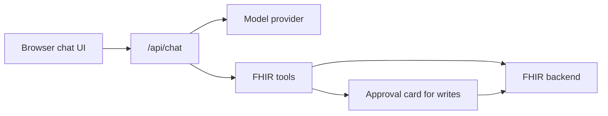

# Architecture

Last EHR is a thin application layer over a FHIR backend. It is not an EHR, not
a system of record, and not a replacement for Medplum, HAPI, or another FHIR
server.

## Runtime shape

## Main modules

- `app/api/chat/route.ts`: the streaming chat endpoint.
- `lib/ai/tools.ts`: the four FHIR tools and the system prompt.
- `lib/fhir/backend.ts`: the `FhirBackend` interface and backend factory.
- `lib/fhir/medplum.ts`: Medplum adapter.
- `lib/fhir/hapi.ts`: plain FHIR R4 REST adapter for local HAPI mode.
- `components/demo/demo-chat.tsx`: browser chat and approval-card rendering.
- `packages/mcp/src`: standalone, Medplum-only MCP package with two
  chart-reading tools.

## Tool surface

Reads:

- `search_patients`
- `show_patient_info`

Writes:

- `add_note`
- `record_observation`

The web app marks write tools with `needsApproval: true`, so the SDK pauses and
the UI renders an approval card before `execute` runs.

## Data boundary

Last EHR stores no chart database of its own.

- Chart data lives in the FHIR backend.
- Chart context read by the agent is sent to the configured model provider.
- The public demo tags writes by browser session so visitors see seed data plus
  their own writes.
- Backend authentication, tenant isolation, and RBAC belong to the FHIR backend.

## Backend boundary

The `FhirBackend` interface is intentionally small:

- `search`
- `searchResources`
- `createResource`
- `deleteResource` for seeding/admin tooling only

Adapter authors should keep the interface boring. Do not add app-specific
authorization logic to an adapter; rely on the backend's own access controls.
