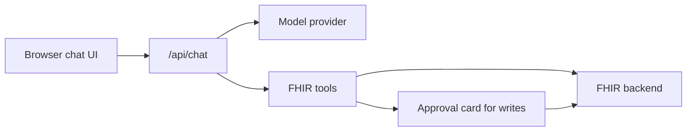

# Architecture

Last EHR is a thin application layer over a FHIR backend. It is not an EHR, not
a system of record, and not a replacement for Medplum, HAPI, or another FHIR
server.

## Runtime shape

```mermaid
flowchart LR
  Browser["Browser chat UI"] --> Chat["/api/chat"]
  Chat --> Model["Model provider"]
  Chat --> Tools["FHIR tools"]
  Tools --> Backend["FHIR backend"]
  Tools --> Approval["Approval card for writes"]
  Approval --> Backend
```

## Main modules

- `app/api/chat/route.ts`: the streaming chat endpoint.
- `lib/ai/tools.ts`: the FHIR tools, the chart-section allowlist, and the system prompt.
- `lib/fhir/backend.ts`: the `FhirBackend` interface and backend factory.
- `lib/fhir/medplum.ts`: Medplum adapter.
- `lib/fhir/hapi.ts`: plain FHIR R4 REST adapter for local HAPI mode.
- `components/demo/demo-chat.tsx`: browser chat and approval-card rendering.
- `packages/mcp/src`: standalone MCP package (Medplum, or the local HAPI
  stack via `FHIR_BACKEND=hapi`): read-only by default with an opt-in
  human-approved write profile, and two
  chart-reading tools.
- `scripts/mcp-demo.ts`: checkout-only synthetic HAPI MCP Local Lab. It shares
  the two read schemas, but its separate read facade resolves only the seeded
  fixture identifiers and never accepts credentials or a remote endpoint.
- `lib/eval/fhir-agent-safety.ts`: disposable synthetic workflow evaluator for
  the web agent's search, proposal, approval, denial, chart-association, and
  cleanup mechanics. It is not a clinical or authorization certification.

## Tool surface

Reads:

- `search_patients`
- `show_patient_info`
- `read_chart_section` — one bounded read over an allowlist of patient-scoped
  chart sections, with status, category, code, and date filters. The tool
  builds every query; the model picks a section and filters and never supplies
  raw search parameters. See [FHIR coverage](./fhir-coverage.md) for the
  current sections and the reasons some resource types are deliberately absent.

Writes:

- `add_note`
- `record_observation`
- `create_task`

The web app marks write tools with `needsApproval: true`, so the SDK pauses and
the UI renders an approval card before `execute` runs. Written observations are
coded from a pinned local LOINC/UCUM table
([`lib/fhir/vitals.ts`](../lib/fhir/vitals.ts)), and the approval card renders
those derived codes from the same function, so the reviewer sees the codes that
will save.

## Data boundary

Last EHR stores no chart database of its own.

- Chart data lives in the FHIR backend.
- Chart context read by the agent is sent to the configured model provider.
- The public demo tags writes by browser session so visitors see seed data plus
  their own writes.
- Backend authentication, tenant isolation, and RBAC belong to the FHIR backend.

## Backend boundary

The `FhirBackend` interface is intentionally small:

- `search`
- `searchResources`
- `createResource`
- `deleteResource` for seeding/admin tooling only

Adapter authors should keep the interface boring. Do not add app-specific
authorization logic to an adapter; rely on the backend's own access controls.
